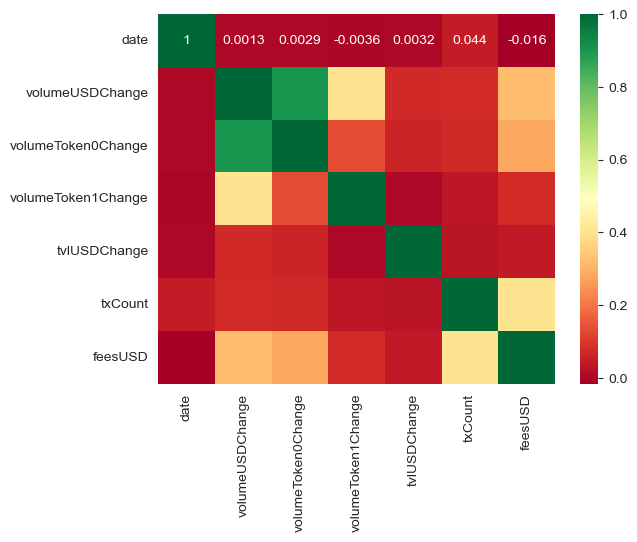
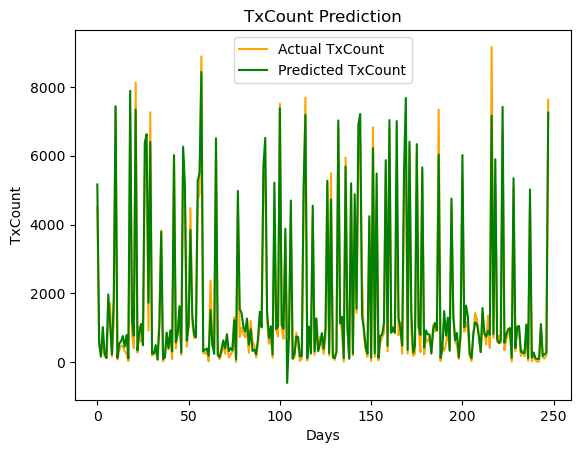

# Takumi

live link - 

> ## Table of Contents

-   [Problem Statement](#Problem-statement)
-   [Solution](#Solution)
-   [How it works](#How-it-works)
-   [Model Building](#Model-Building)
    -   [Training Data Collection](#Training-Data-Collection)
    -   [Data Analysis](#Data-Analysis)
    -   [Data Preparation](#Data-Preparation)
    -   [Model training](#Model-Training)
    -   [Model Testing](#Model-Testing)
-   [Giza](#Giza)
    -   [Setup](#Setup)
    -   [Transpiling The Model](#Transpiling-The-Model)
    -   [Endpoint Deployment](#Endpoint-Deployment)
-   [Technologies Used](#technologies-used)
    -   [Smart Contract](#Solidity-smart-contracts)
    -   [LightLink Testnet](#LightLink-Testnet)
    -   [API3](#API3)
    -   [Backend](#backend)
-   [Agent Business Case](#Agent-Business-Case)
-   [Agent Functionality](#Agent-Functionality)
-   [Possible Improvements](#Possible-Improvements)

#

> ## Problem-statement

Problem Statement: Organizers of web3 giveaways(Individuals and Protocols) lack a user-friendly and transparent platform for 
efficiently managing and equitably distributing giveaway amounts. Additionally, users face challenges in discovering legitimate 
giveaways and airdrops. The need is for a solution that streamlines giveaway organization, enhances transparency, and provides a 
reliable platform for users to find credible opportunities.

> ## Solution

Solution: Introducing a platform that empowers both protocols and individuals to effortlessly organize giveaways and initiate 
airdrops. Through this solution, rewards are distributed randomly among participants, ensuring a fair and engaging experience for all 
involved.

> ## How-it-works

For Organizers: Organizers can effortlessly initiate giveaways and airdrops through a user-friendly form, detailing the designated 
amount for each event. Upon completion, organizers will be prompted to sign a transaction, securely locking the specified amount of 
ETH or airdropped tokens in a smart contract dedicated to tracking each giveaway or airdrop.

For Users: Users can visit the app's Explore page, featuring a comprehensive list of available giveaways and airdrops. If not claimed 
previously, users can click the "Claim" button. Upon doing so, they will be prompted to sign a transaction, enabling a randomized 
allocation of their share in the giveaway or airdrop.

> ## Model Building

-   ### **Training Data Collection**

    In order to train the model data is needed and the data selceted for the training needs to be in line(corelated) with the fees that can be earned in a pool. The selected parameters that were used are as follows.
    1. date
    2. volumeUSDChange(24hr)
    3. volumeToken0Change(24hr)
    4. volumeToken1Change(24hr)
    5. tvlUSDChange(24hr)
    6. txCount(24hr)
    7. feesUSD(24hr)

    To get the data we had to query the Uniswap V3 subgraph for poolDayData, the code below shows a function to run a sample query:
    // Fetch the pool day data for a specific pool and date
    const fetchPoolDayData = async (poolId, date) => {
    const query = `
        {
        poolDayDatas(where: { pool: "${poolId}", date: ${date} }) {
            date
            volumeUSD
            volumeToken0
            volumeToken1
            tvlUSD
            txCount
            feesUSD
        }
        }
    `;
    const response = await axios.post(SUBGRAPH_URL, { query });
    console.log(response.data);
    return response.data.data.poolDayDatas[0];
    };

    The queried data still had to go through some processing to get the values we need to do that we wrote this function:
    // Process the pool day data to calculate daily changes
    const processPoolData = (poolData) => {
    const processedData = [];

    for (let i = 1; i < poolData.length; i++) {
        const prevDay = poolData[i - 1];
        const currDay = poolData[i];

        processedData.push({
        date: currDay.date,
        volumeUSDChange: currDay.volumeUSD - prevDay.volumeUSD,
        volumeToken0Change: currDay.volumeToken0 - prevDay.volumeToken0,
        volumeToken1Change: currDay.volumeToken1 - prevDay.volumeToken1,
        tvlUSDChange: currDay.tvlUSD - prevDay.tvlUSD,
        txCount: currDay.txCount,
        feesUSD: currDay.feesUSD,
        });
    }

    return processedData;
    };

    We then queried 100 days of the top 10 pools on uniswap based on trading volume and wrote them all to a csv file which can be found [here](https://github.com/NatX223/Liquidity-Manager/blob/main/Indexer/Data/queries/PoolData.csv).
    The complete code to the data collection script can be found [here](https://github.com/NatX223/Liquidity-Manager/blob/main/Indexer/Data/queries/UniswapV3query.mjs)

    To run the above script locally, clone the repo, cd into the Indexer/Data folder then run the following command
    ```bash
    npm install
    # or
    yarn add
    ```
    then simply run this command
    ```bash
    node UniswapV3query.mjs
    ```

-   ### **Data Analysis**

    The first step in the training process was to read and analyze the data which was scraped from on chain events and put into a csv format. The data is read using the popular pandas framework. Below are some general information about the data.

    <class 'pandas.core.frame.DataFrame'>
    RangeIndex: 990 entries, 0 to 989
    Data columns (total 7 columns):
    #   Column              Non-Null Count  Dtype  
    ---  ------              --------------  -----  
    0   date                990 non-null    int64  
    1   volumeUSDChange     990 non-null    float64
    2   volumeToken0Change  990 non-null    float64
    3   volumeToken1Change  990 non-null    float64
    4   tvlUSDChange        990 non-null    float64
    5   txCount             990 non-null    int64  
    6   feesUSD             990 non-null    float64
    dtypes: float64(5), int64(2)
    memory usage: 54.3 KB

    we can that there are seven columns in total  with about 990 columns. All the columns are quantitative variables as such we can use a scatter plot to visualize their relationship ( correlation ) with each other.

    Using seaborns pairplot function we can see the correlation between pairs of different column combinations.

    .png>)

    We also use a heat map to get a more detailed look between
    the correlation of columns

    

    From the heat map we can see that date has the worst correlation with the other columns than any other column as such we drop it from the data frame.

    The data analysis notebook can be found [here](https://github.com/NatX223/Liquidity-Manager/blob/main/ai_training/pool_data_analysis.ipynb)

-   ### **Data Preparation**
    ⦁	The data is scaled using a min max scaler
    Transform features by scaling each feature to a given range.
    This estimator scales and translates each feature individually such that it is in the given range on the training set, e.g. between zero and one.
    ⦁	We then create prediction sequences where all the columns in row N would be used to predict ( txCount , feesUSD) in row N+1.
    ⦁	The data is the split into 90% training and 10% validation.

-   ### **Data Training**
    The model is a multilayer perceptron linear model and has the following specs
    ⦁	it has 6 input units matching the number of columns in our data
    ⦁	it has 6 hidden units
    ⦁	the output has 2 units to represent the two columns the model would be predicting in the next row of data

-   ### **Model Testing**
    After training the model on the training data we test its performance on the validation data ( data it has not been trained on ).
    The model got a loss of 0.0012 ( MEAN SQUARED ERROR ) 
    We also visualize how well the model predicts the data using a graph

    

    

    From the graphs we can see the  prediction of txCount and feesUSD by the model labelled in green vs the actual ones in orange sampled from the dataset and the model seems to perform quite well.

> ## Giza

-   ### **Setup**
    The first step taken was creating a python virtual environment then the Giza SDK was installed using the following command
    ```bash
    pip install giza-sdk
    ```
    next we installed the Giza CLI with
    ```bash
    pip install giza-cli
    ```
    we also installed the agents sdk using
    ```bash
    pip install giza-agents
    ```
    We then created a user account with the
    ```bash
    giza users create
    ```
    the next step was to login in to the account with the command
    ```bash
    giza users login
    ```
    We also created an API key with the command below
    ```bash
    giza users create-api-key
    ```

> ## Agent Business Case

Purpose of the AI Agent:
The AI agent is designed to optimize yield farming by periodically evaluating and selecting the most profitable liquidity pools. By leveraging advanced algorithms and real-time data analysis, the agent can identify pools with the highest potential returns. This allows users to maximize their earnings without the need for constant monitoring and manual adjustments.

Problem it Solves:
1. Complexity and Time-Consumption:
Yield farming involves complex strategies and requires continuous monitoring of multiple liquidity pools to ensure optimal returns. This process can be time-consuming and difficult for individual investors to manage effectively.

2. Market Volatility:
Cryptocurrency markets are highly volatile, with liquidity pool performance fluctuating rapidly. Without the ability to quickly adapt to these changes, investors may miss out on high-yield opportunities or incur losses.

How the AI Agent Addresses These Issues:
1. Automated Optimization:
The AI agent automates the process of identifying and investing in the most profitable liquidity pools, saving users time and reducing the complexity involved in yield farming.

2. Real-Time Data Analysis:
By continuously analyzing market data and pool performance, the AI agent can quickly respond to changes and adjust investments to ensure maximum returns.

Overall, the AI agent simplifies yield farming, making it accessible and profitable for a wider range of users, from individual investors to large-scale stakeholders.

> ## Agent Functionality

Automated Pool Selection
The AI agent continuously scans various liquidity pools to identify those with the highest potential returns.
It evaluates multiple factors such as historical performance, current market trends, and volatility to make informed decisions.

Yield Optimization
The agent automatically reallocates assets to the most profitable pools based on real-time data analysis.
It ensures optimal yield farming strategies without requiring user intervention.

Performance Tracking:
The AI agent tracks the performance of each investment, providing detailed reports on returns and pool dynamics.
Users can view historical data and performance metrics to assess the effectiveness of the agent's strategies.

> ## Possible Improvements

Multi-Chain Support: Enabling the agent to operate across multiple blockchains to diversify opportunities
and mitigate risks associated with a single network.

Model retraining: Using a larger dataset to further train the model, the new dataset would be cleaner and also less noisy. Other variables can also be taken into account (increasing dimensions)

